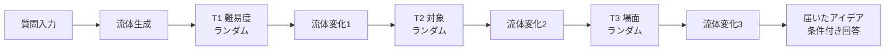

# 流体タービン変換 UI 実装計画

## ゴール（ユーザー確定仕様）

| 項目 | 内容 |
|------|------|
| 入力 | 質問1行 |
| 中間 | 質問 → **流体UI** → 3タービン順通過 |
| タービン軸 | ①難易度 ②対象（自分・相手） ③場面 — **各軸1項目、実行のたびにランダム** |
| 通過時 | そのタービンの値に応じて **流体が視覚変化** |
| 出力 | **届いたアイデア** に、難易度・対象・場面に合わせた回答テキスト |

## 現状との差分

現在の [`src/frontend/src/App.jsx`](src/frontend/src/App.jsx) は **玉 → ドミノ → 歯車（キーワード）→ 3タービン（ラベルなし）** のピタゴラ連鎖。[`deliveryApi.js`](src/frontend/src/deliveryApi.js) は `gearKeywords` 中心で、タービン軸・流体状態は未実装。

**方針**: 入口〜タービン区間を **流体パイプライン** に置き換え。配達口・📬届いたアイデア・カプセル演出は維持（審査3分デモ向け）。



## Step 1: データモデルとランダム選択

新規 [`src/frontend/src/turbinePools.js`](src/frontend/src/turbinePools.js)

```javascript
export const TURBINE_AXES = [
  { id: "difficulty", label: "難易度", pool: ["やさしい", "ふつう", "むずかしい"] },
  { id: "audience",   label: "対象",   pool: ["自分", "相手", "みんな"] },
  { id: "scene",      label: "場面",   pool: ["会議", "学校", "日常", "審査"] },
];

export function rollTurbineRun() {
  return TURBINE_AXES.map((axis) => ({
    ...axis,
    value: axis.pool[Math.floor(Math.random() * axis.pool.length)],
  }));
}
```

- **`runChain` 開始時**（[`App.jsx`](src/frontend/src/App.jsx) の `resetShow` 直後）に `rollTurbineRun()` を1回呼び、当該実行中は固定
- タービン SVG の下に **軸名 + 抽選値** を常時表示（IT素人向け：「難易度：やさしい」）

## Step 2: 流体状態と変換ルール

新規 [`src/frontend/src/fluidState.js`](src/frontend/src/fluidState.js)

**FluidState**（CSS 変数 / inline style に直結）:

| プロパティ | 用途 |
|-----------|------|
| `hue` | 色味（0–360） |
| `speed` | 流れ速度（0.5–1.6） |
| `opacity` | 透明度 |
| `blur` | にじみ |
| `particleScale` | 粒子サイズ |
| `wave` | 波の振幅 |
| `label` | 質問の先頭8文字 |

**初期化** `createFluidFromQuestion(question)`:
- 質問文字列の簡易ハッシュ → `hue`（API不要・再現性あり）
- デフォルト: 中速・半透明・中サイズ粒子

**変換** `applyTurbineTransform(state, axisId, value)` — 通過のたびに **累積適用**:

| 軸 | 値 | 流体への効果（審査員が一目で分かる差） |
|----|-----|----------------------------------------|
| 難易度 | やさしい | 明るい水色、hue+20、speed×0.7、粒子大 |
| | ふつう | 変化小（基準維持） |
| | むずかしい | 濃い青紫、hue−30、speed×1.3、粒子小・blur↑ |
| 対象 | 自分 | 暖色寄り（hue+15、opacity↑） |
| | 相手 | 寒色寄り（hue−15） |
| | みんな | 黄緑寄り、wave↑ |
| 場面 | 会議 | wave↓（直線的・落ち着き） |
| | 学校 | wave↑（弾む） |
| | 日常 | opacity↑、speed×0.9 |
| | 審査 | speed×1.2、blur↓（はっきり） |

数値は実装時に CSS アニメと目視調整（30分バッファ）。

## Step 3: 流体UIコンポーネント

新規 [`src/frontend/src/FluidStream.jsx`](src/frontend/src/FluidStream.jsx)

- **技術**: 純 CSS + SVG（物理エンジンなし、3時間制約）
- 構成:
  - 横パイプ（`.fluid-pipe`）
  - 内部 `.fluid-blob`（`linear-gradient` + `filter: blur()` + `@keyframes fluidFlow`）
  - 質問ラベル `.fluid-label` を流体上に追従
  - `fluidState` を CSS 変数 `--fluid-hue`, `--fluid-speed` 等にバインド
- **通過アニメ**: `passIndex`（0→1→2→3）で blob の `transform: translateX()` を段階的に進行；各タービン到達時に `onPassComplete(i)` で `applyTurbineTransform` → 0.4s の `transition` で色・速度が変わる

既存 [`index.css`](src/frontend/src/index.css) に流体・パイプ用スタイルを追加。ball/domino/gear 用 CSS は **未使用化**（削除は任意、時間がなければ残置）。

## Step 4: App.jsx の状態機械リファクタ

[`App.jsx`](src/frontend/src/App.jsx) の `chainStep` を拡張:

| step | 画面 | statusMessage 例 |
|------|------|------------------|
| 0 | 流体生成 | 「質問を流体に変えています…」 |
| 1 | T1通過・変化 | 「難易度：やさしい — 流体が変わりました」 |
| 2 | T2通過・変化 | 「対象：相手 — 流体が変わりました」 |
| 3 | T3通過・変化 | 「場面：会議 — 流体が変わりました」 |
| 4 | 配達口 | 「答えを届けました！」 |

- `runChain` 内:
  1. `const turbines = rollTurbineRun()`
  2. `let fluid = createFluidFromQuestion(text)`
  3. タイマーで step 1〜3 の各完了時に `fluid = applyTurbineTransform(fluid, turbines[i].id, turbines[i].value)` → `setFluidState(fluid)`
  4. 並行して `fetchDelivery(text, turbines)` を await
- 3つの [`Turbine`](src/frontend/src/App.jsx) コンポーネントに `axisLabel` / `axisValue` props を追加し、回転は既存 `turbineAngle` を維持
- **削除・置換**: ball / domino / gear セクション → `FluidStream` + ラベル付きタービン3台

## Step 5: 回答生成（条件付き）

[`deliveryApi.js`](src/frontend/src/deliveryApi.js) を拡張:

**リクエスト**（API 接続時）:
```json
{
  "text": "タービンって何？",
  "turbines": {
    "difficulty": "やさしい",
    "audience": "相手",
    "scene": "審査"
  }
}
```

**レスポンス** に `turbines` をエコー + `deliveryItems`（既存形式維持）。

**フォールバック** `buildAnswerFallback(input, turbines)` — ルールベースで3軸を反映:

- **やさしい**: 短い文、専門語を避ける（「羽根が回る」等）
- **むずかしい**: 変換・エネルギー等の語彙を少し増やす
- **自分**: 「自分が理解するには…」
- **相手**: 「相手に説明するときは…」
- **場面**: 会議→要点3つ、学校→例え話、審査→デモ向け一言、日常→身近な例

届いたアイデア UI に **通過条件の recap** を追加:
```
難易度：やさしい / 対象：相手 / 場面：審査
```
（`gearKeywords` 行は `turbineRecap` に差し替え）

## Step 6: API（P1・時間があれば）

[`src/backend/`](src/backend/) に Lambda ハンドラ（[hackathon-bedrock](.cursor/skills/hackathon-bedrock/SKILL.md) 準拠）:
- プロンプトに `turbines` を渡し、JSON で `deliveryItems` を返す
- 未接続時は現状どおりクライアントフォールバック（審査デモはサンプル質問2つで完走可能）

## Step 7: デモ・検証

- [`docs/demo-script.md`](docs/demo-script.md) の3分フローを更新:
  1. 「タービンって何？」入力 → 仕掛けを動かす
  2. 流体が3タービンを通り **色・速さが変わる** ことを指差し
  3. 届いたアイデアで **条件付き回答** を読む
- `npm run build` → `./infra/deploy-s3.ps1` → Chrome で公開 URL 確認
- 連打時: `busy` ガード + `clearTimers` でアニメ競合防止（既存パターン流用）

## ファイル変更一覧

| ファイル | 操作 |
|---------|------|
| `src/frontend/src/turbinePools.js` | 新規 |
| `src/frontend/src/fluidState.js` | 新規 |
| `src/frontend/src/FluidStream.jsx` | 新規 |
| `src/frontend/src/App.jsx` | 流体連鎖・タービンラベル・状態機械 |
| `src/frontend/src/deliveryApi.js` | turbines 引数・条件付き fallback |
| `src/frontend/src/index.css` | 流体パイプ・通過アニメ |
| `docs/demo-script.md` | 審査手順更新 |
| `src/backend/` Lambda | P1（任意） |

## リスクと切り詰め

| リスク | 対策 |
|--------|------|
| 流体変化が分かりにくい | 通過時に status-banner + タービン値を0.5s 強調（scale/pulse） |
| 3時間不足 | Lambda は後回し；フォールバック + サンプル質問で完走 |
| 自由質問で回答が弱い | recap に「今回の条件」を明示し、デモは用意質問を推奨 |

## 実装順序（推奨）

1. `turbinePools.js` + `fluidState.js`（ロジック単体）
2. `FluidStream.jsx` + CSS（静止状態で3段階の見た目差を確認）
3. `App.jsx` 配線（アニメ + ランダム）
4. `deliveryApi.js` 条件付き回答
5. ビルド・デプロイ・demo-script 更新
6. （余力）Lambda
